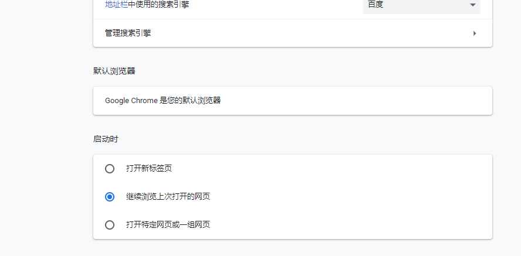

# 电子科技大学研究生健康状况自动填报

## selenium以及chromedriver

UESTC.py主要使用selenium模块来模拟浏览器操作，需要下载chrome浏览器的[chromedriver接口](https://chromedriver.chromium.org/), 请在上面网站中根据浏览器版本，下载相应版本的chromedriver。

## 配置

在`self.driver = webdriver.Chrome(r"D:/chromedriver.exe", options=option)`将地址更换为你的chromedriver所在位置。

在`option.add_argument(r"user-data-dir=C:/Users/onion_rain\AppData/Local/Google/Chrome/User Data")` 中将地址更换为chrome用户数据所在位置（以便使用cookie免登陆）。

浏览器需设置启动时继续浏览上次打开的网页

